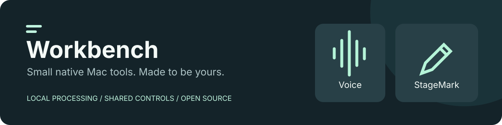

# Workbench Voice

**[Download the apps, try a workflow, and share feedback](https://workbench-mac.vercel.app)**



[](https://github.com/EthDawg/local-voice/actions/workflows/ci.yml)
[](LICENSE)
[](https://github.com/EthDawg/local-voice/issues?q=is%3Aissue%20is%3Aopen%20label%3A%22good%20first%20issue%22)

**[Start contributing](CONTRIBUTING.md)** · **[Pick a starter issue](https://github.com/EthDawg/local-voice/issues?q=is%3Aissue%20is%3Aopen%20label%3A%22good%20first%20issue%22)** · **[Ask a question](https://github.com/EthDawg/local-voice/discussions)**

A native Mac app for local dictation and text-to-speech. Speak a thought, clean up fillers and corrections, and return the text to the app you started in. Or paste text, listen to it, and save an M4A reading.

Built for Apple Silicon, with Parakeet v2 through FluidAudio and the voices installed in macOS. No accounts, API keys, subscriptions, Python environment, or background server.

## Help shape Workbench

Workbench is an open-source collection of small native Mac utilities: **[Voice](https://github.com/EthDawg/local-voice)** for dictation and reading, and **[StageMark](https://github.com/EthDawg/StageMark)** for presenting. Each app works independently. Our focus is useful everyday tools, local processing, clear controls, and recoverable user data.

First contribution? Fix a confusing instruction, test a workflow on your Mac, improve keyboard access, or take a small Swift change. You do not need to be a Swift expert. [The contributor guide](CONTRIBUTING.md) takes you from choosing an issue to opening your first pull request. Documentation can be edited directly on GitHub without a Mac.

We are early: expect rough edges and a small maintainer team. The [open issues](https://github.com/EthDawg/local-voice/issues) are the live backlog; `good first issue` marks bounded starting points and `help wanted` marks broader work. [Discuss larger ideas](https://github.com/EthDawg/local-voice/discussions) before investing heavily. We welcome documentation, accessibility, design, bug reports, and testing as well as code.

## Install from source

Requires an Apple Silicon Mac, macOS 14 or later, Xcode Command Line Tools (Swift 6.2 or later, with the macOS 26 SDK), and an internet connection for the initial dependency/model download. Developed and tested on macOS 26.5.1; older supported OS versions are not yet independently tested.

```sh
git clone https://github.com/EthDawg/local-voice.git
cd local-voice
bash scripts/install.sh
```

The installer verifies the build and speech engine before replacing an existing installation. It preserves the previous app as a rollback ZIP. It builds and locally signs `Workbench Voice.app`, installs it in `~/Applications`, downloads and prepares the English model, runs a real speech/transcription/export round-trip, then opens the app. The first model preparation can take several minutes. Afterward, it works offline. It does not start automatically at login.

For updates, quit the app, pull the repository, and run the installer again. User drafts and history live outside the app bundle.

## Use it

- **Dictate:** click the microphone, speak, then click Stop. macOS asks for microphone permission the first time.
- **From another app:** press **Control + Option + Space** to start and again to finish. Choose **Press & hold** in quick controls if you prefer releasing the shortcut to finish. Both shortcuts are editable: click the keycap with the pencil, then press your combination. Escape cancels; Delete disables. Unavailable combinations leave your existing shortcut unchanged.
- **Quick controls:** click the waveform in the menu bar or press **Control + Option + V**. Dictate, Read, Recent, and Settings tabs cover everyday controls. Both shortcuts are editable in the Settings tab and in the editor’s Shortcuts / Settings pages. Command + comma opens Settings.
- **Cleanup:** **Light** is the fast default for filler sounds, accidental repetition, explicit corrections, and requested lists. **Original** skips cleanup; **Natural** adds guarded, optional editing with Apple Intelligence on supported macOS 26 Macs, falling back to Light when unavailable or an edit changes checked facts. The **Original…** view retains the unedited transcript. **Clean text** also tidies an existing draft.
- **Automatic paste:** choose **Paste automatically** and enable macOS Accessibility. Voice attempts paste only if the original app and focused field are still current; secure fields are excluded. It never presses Return. Confirmed insertion can restore your previous clipboard. If focus changes or insertion cannot be confirmed, the transcript stays copied. **Copy to clipboard** is always available.
- **Capture panel:** click **Finish** to stop recording, or use its real **More** menu to discard. Drag the grip at the left to move it; Voice remembers the position across recordings and launches. Settings → **Position dictation panel…** previews it with the microphone off. The menu can reset its position.
- **Reuse a capture:** open quick controls from a text field, choose **Recent**, and Copy, Open, or Paste any saved capture. The Dictate tab also shows the latest capture and two preceding captures. Opening an older capture does not relabel it as the latest recording.
- **Workbench:** both Voice and [StageMark](https://github.com/EthDawg/StageMark) share a suite switcher, appearance settings, and Spotlight prefix. Search **Workbench** to find them.
- **Read aloud:** choose an installed voice and pace, enter text, and click Listen. Pause, resume, stop, or save an M4A file.
- **Import audio:** transcribe an audio file up to 30 minutes. Original imported files are never modified.
- **Dictionary:** replace recognised words or phrases with your preferred spelling. Matches whole words, ignoring case. Dictionary replacements run after cleanup.
- **Recent transcripts:** the last 100 completed captures stay on this Mac, including separate recordings with identical words. Search checks both cleaned and original text. The full history offers original wording and read-aloud actions. Captures are saved before clipboard or paste delivery; existing history survives updates.

Closing the window keeps the app in the menu bar. Use **Quit Workbench Voice** or Command + Q to exit completely.

## Privacy and limits

Audio is processed locally. Recordings are made only after a button or shortcut starts capture. Recordings are limited to five minutes; text-to-speech is limited to 50,000 characters per reading. Dictation is English. Recognition and cleanup quality vary. Light rules recognise explicit patterns rather than every possible spoken correction; complex or ambiguous wording can remain unchanged. Natural editing checks factual token order, numbers, and negation, but these checks do not prove semantic equivalence. The original remains available. There is no cloud fallback.

The model is downloaded from FluidInference on Hugging Face during setup. FluidAudio caches it in the user's Application Support directory. No audio, transcript, clipboard content, or telemetry is uploaded by this app.

Drafts, originals, the dictionary, voice preferences, and recent transcripts are stored in `~/Library/Application Support/LocalVoice/state.json`, readable by the current user. Successful microphone recordings and temporary readings are deleted. Failed microphone recordings remain temporarily available for Retry until the next recording or app exit. The clipboard retains copied transcripts; automatic paste can restore its previous contents after confirmed insertion. Imported audio is not copied into history.

Official Voice 1.2.2 early-access downloads are Developer ID signed and Apple-notarised. Get the versioned download and trial guide from [the Workbench website](https://workbench-mac.vercel.app). Source builds remain ad-hoc signed and do not need paid Apple membership. Code or signing changes can cause macOS to ask for permissions again.

If Accessibility is switched on but Voice still shows **Enable automatic paste**, macOS may have retained permission for an earlier build. Quit Voice, open **System Settings → Privacy & Security → Accessibility**, select only **Workbench Voice**, remove that entry with **−**, then use **+** to add `~/Applications/Workbench Voice.app` again. Reopen Voice and check for **Automatic paste ready**. This was required and verified after the local build update. Ad-hoc signatures identify a specific build, as explained in [Apple's code-signing requirements](https://developer.apple.com/documentation/technotes/tn3127-inside-code-signing-requirements).

## Development and checks

```sh
bash scripts/test.sh
bash scripts/build.sh
"$HOME/Applications/Workbench Voice.app/Contents/MacOS/LocalVoice" --self-test
"$HOME/Applications/Workbench Voice.app/Contents/MacOS/LocalVoice" --transcribe /path/to/audio.m4a
```

The self-test synthesizes a known passage with macOS speech, transcribes it with Parakeet, checks key phrases, exports a non-empty M4A, then transcribes that export. Twenty-one core checks cover dictionary boundaries and escaping, state persistence, damaged-state behaviour, and input limits. Sixteen additional cleanup checks cover correction and list cases, factual edit rejection, original line breaks, and version-one state migration. `--check-cleanup` exercises the actual optional Apple language model. They run without XCTest or a full Xcode installation. Microphone permission, recording, and UI behaviour also need interactive testing; file round-trips alone do not prove microphone capture.

## Design and credits

The shared platform contract is [Workbench](docs/workbench.md). See [the implementation notes](docs/design.md) and [validation results](docs/validation.md).

- [FluidAudio](https://github.com/FluidInference/FluidAudio), pinned to 0.15.6: Apache 2.0.
- [Parakeet TDT v2 CoreML](https://huggingface.co/FluidInference/parakeet-tdt-0.6b-v2-coreml): see the upstream model card and license.
- Apple AppKit, SwiftUI, AVFoundation, and installed macOS voices.
- Workflow inspiration: [Pat Simmons's local Wispr Flow replacement](https://www.youtube.com/watch?v=IMQw3aHjf2Q&t=437s).

The app code is MIT licensed. Third-party components retain their own licenses.
