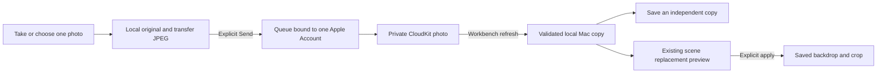

# Photo for Mac

Canonical product and engineering contract, 13 September 2026. This feature is implemented in the current Preview source. A provisioned iPhone–Mac transfer has **not yet been verified**; compilation, synthetic tests and a visible local photo are not evidence of cloud delivery. See [verification](#verification-and-acceptance) before describing availability.

## The job and its boundaries

**Take or choose a photo while away from the Mac, deliberately keep it for later, then find a usable local copy in Workbench when returning to the Mac.** Optional private iCloud handles the distance between devices. Workbench handles the selected collection, honest status and the next useful action.

| Rank | Outcome | Current scope |
| --- | --- | --- |
| **1** | A chosen photo reaches the Mac later, without matching folders by hand. | Native Camera/Photos, optional name, local preservation, explicit Send, private account-bound cloud queue, Mac **Saved resources → From iPhone**. Implemented; real paired transfer remains unverified. |
| **2** | Reuse that photo as a backdrop without rebuilding a composition. | **Use as backdrop…** chooses an existing saved scene and opens its ordinary replacement preview. Applying saves only its backdrop/crop; foreground layers and currently presented output stay intact. Implemented. |
| **3** | Take a nearby photo directly into the Mac. | Apple's Continuity Camera integration is parked. It is a different, Mac-initiated job and does not solve capture while away. |

This is selected-photo handoff, not synchronization of the whole Photos library, Workbench documents, transcripts, recordings, dictionary or scene edits. It creates no public download link or shared team library. Ethan and Matt using different Apple Accounts do not receive each other's private photos. Desktop wallpaper and presentation composition remain independent jobs; handoff never installs wallpaper or starts a presentation.

## What Apple already supplies

| Native option | Already useful for | What Workbench adds, if needed |
| --- | --- | --- |
| **iCloud Photos** | Photos available across the user's devices. | A small, deliberately selected Workbench collection and a direct next action. If ordinary Photos availability solves the job, no new transfer tool is needed. [Apple guide](https://support.apple.com/en-gb/108782) |
| **AirDrop** | Explicit transfer to a nearby Apple device. | A durable pending item for a Mac that will be used later. AirDrop arrival does not itself import an item into Workbench. [Apple guide](https://support.apple.com/guide/iphone/use-airdrop-to-send-items-to-nearby-devices-iphcd8b9f0af/ios) |
| **Files / iCloud Drive** | Deferred file availability in Files and Finder, including manual export. | Selection, account-bound retry and clear local availability without asking the user to pair folders. Cloud visibility alone does not mean a file is downloaded. [Apple sync guide](https://support.apple.com/en-au/guide/icloud/mm19ef899373/icloud), [download controls](https://support.apple.com/guide/mac-help/work-with-folders-and-files-in-icloud-drive-mchl1a02d711/mac) |
| **Continuity Camera** | A supported Mac app requests a nearby iPhone/iPad photo or document scan. | A future native entry into the existing import flow. This is distinct from iPhone-as-webcam and the existing device presentation feed. [Apple user guide](https://support.apple.com/en-gb/102332), [AppKit integration](https://developer.apple.com/documentation/appkit/supporting-continuity-camera-in-your-mac-app) |

## Competitor research and what survives the review

Reviewed primary product documentation on 13 September 2026, with a bounded trial attempt rather than a claim to have exhaustively tested these products.

| Reference | Useful pattern | Workbench decision |
| --- | --- | --- |
| [Yoink for Mac](https://eternalstorms.at/yoink/mac/) and [iOS](https://eternalstorms.at/yoink/ios/) | A temporary shelf makes moving selected content easier; nearby Handoff/Continuity and iOS cloud capabilities have distinct availability. | Borrow one recognisable arrival surface, not a general cross-app shelf. The official trial was installed after Developer ID/signature verification; native automation did not obtain an operable trial window. No completed hands-on transfer is claimed. |
| [Anybox](https://anybox.app/) | Private Apple-device collection and retrieval. | Borrow deliberate collection and useful recall; reject tags, albums and an all-content organiser for this job. |
| [Dropover](https://dropoverapp.com/faq) | Quick gathering and optional cloud-link sharing. | A shareable download link serves another recipient; it is not a private same-account inbox. No public-link backend added. |
| [LocalSend](https://github.com/localsend/localsend) and its [protocol](https://github.com/localsend/protocol) | Nearby cross-platform transfer without a hosted file store. | Retain as a future interoperability reference. It does not solve deferred arrival while the receiving Mac is absent. |
| [Unclutter](https://unclutterapp.com/changelog) | A files shelf with provider-backed folder workflows; its fixes document placeholder/rename edge cases. | Shared-folder access needs hydration, conflict and permission care. It is an alternative, not a shortcut around sync correctness. |

A Claude architecture critique received a generic design brief, not repository source or private records. We accepted its reliability-first framing, optional naming and insistence that cloud upload cannot prove Mac arrival. We rejected its shared-folder-first recommendation: it moves setup and provider repair onto every user. Apple confirms both CloudKit and iCloud Documents support Developer ID distribution; neither is an App-Store-only route. CloudKit also does not automatically supply an Android migration path. The decision below records those tradeoffs rather than treating the critique as authority.

## The current journey

1. On iPhone or iPad, choose **Take a photo for Mac** from Tools. Take a photo or select one with the native Photos picker. Camera denial, cancellation or unavailable hardware leaves Photos available.
2. Review the image and optional name. **Keep on this device** saves locally. **Send photo** saves locally first, then explicitly queues that photo for the connected private iCloud account. Enabling handoff alone does not send older local photos.
3. On the Mac, enable handoff using the same Apple Account and open **Saved resources → From iPhone**. Launch, activation and **Refresh** check for arrivals when enabled. A downloaded copy can be used offline.
4. Choose **Save a copy…**, or **Use as backdrop… → saved scene → Preview backdrop**. The replacement editor requires a deliberate apply action. With no saved scene, prepare one in **Present a device** first; receiving a photo does not create a duplicate scene.



There is no constant background receiver, push notification or delivery-time promise. Refresh performs bounded work and may ask for another refresh. A suspended app, offline device, unavailable account, quota error or retry delay can postpone transfer. Turning handoff off stops further cloud work; local files and already accepted cloud copies remain. Cancellation cannot retract a write the server already accepted.

## Data, status and lifecycle contract

**Original means the bytes supplied by the selected-photo or camera adapter before Workbench processing.** The camera may supply an encoded image rather than a sensor/RAW original. Workbench retains those bytes on the sending device; it does not silently add a camera capture to the system Photos library. The Mac receives an optimised derivative, not the full original asset.

The current normalisation accepts one decodable still image, at most 64,000,000 input bytes and 50 megapixels. It applies orientation, draws a fresh sRGB image, flattens transparency to white and encodes JPEG at quality 0.88 with a maximum 3840-pixel long edge. GPS/EXIF and source comments are not copied into that JPEG. The transfer limit is 40,000,000 bytes. These limits describe this implementation, not a promise to preserve HDR, transparency, Live Photos or every source format.

| Visible status | What has happened |
| --- | --- |
| **Only on this device** | Local image files and manifest were saved. No cloud send was requested. |
| **Queued for iCloud** / **Uploading to iCloud** | Send intent is durable for one account; upload is pending or in progress. |
| **In iCloud** | Cloud upload was acknowledged and that state saved locally. This does **not** mean the Mac has received it. |
| **Downloaded on this device** | The receiver validated the JPEG and committed its local files and manifest. |
| **Removal queued** | A cloud removal intent is saved and still needs completion. |
| **Removed from iCloud · local copy kept** | Cloud removal was acknowledged or observed; this device's independent copy remains. |

Engineering invariants:

- `PhotoHandoffModel` owns one local, versioned `photos.json` manifest plus UUID-named image directories. Media is staged before installation; the manifest uses atomic writes. Files are validated before publishing a usable result. An unreadable or future-version manifest blocks writes and preserves its files.
- A photo has a stable UUID, version, title, creation time, source platform, byte count, dimensions and SHA-256 digest. Retrying the same UUID/content is idempotent; the same UUID with different content or ownership is an error. User titles and remote metadata never become storage paths. Received data is checked for supported version, size, digest, JPEG decoding and dimensions.
- Queue ownership and refresh checkpoints use **container + environment + opaque CloudKit user record identity**. Explicit Send may queue offline for the last verified owner; it never binds an unknown owner. Before network work, the current account must still match. Account changes and disablement cancel owned operations and invalidate late completions. Reconnecting another account does not retarget the previous account's queue; its data remains stored separately.
- Cloud records use the private `WorkbenchPhotosV1` zone and `PhotoV1` record type. Zone ownership uses the captured account's actual record name, not a current-user placeholder. This boundary still needs a real signed account-switch test.
- A receiver advances its per-account change checkpoint only after every item in that batch is validated and durably handled. Damaged or conflicting data keeps the previous checkpoint. An expired checkpoint is cleared for a later rescan, with UUID/digest deduplication. Server retry-after delays are retained. There is no endless retry loop.
- Local removal deletes the app-owned local item and retains an account/UUID/digest suppression receipt, so an ordinary refresh does not immediately download it again. It does not delete an existing cloud copy. Removing a queued local item also removes its pending send. Cloud removal is separate and explicit; its durable intent takes precedence over upload retries. Already downloaded copies and independent scene/export copies survive cloud removal.
- A scene receives its own copy only when the existing replacement transaction is applied. Cancel leaves the scene unchanged; apply checks for a stale backdrop and preserves newer unrelated scene fields. The live presentation and desktop are not rewritten by this save.

## Architecture decision: private CloudKit, with local ownership

The decision is driven by a small collection with stable item identity, explicit send/removal and status. It is not a workaround for missing developer signing. Apple identity and storage remove the need for a Workbench account or service credential; account/storage availability still matters.

| Option | Decision and trigger to revisit |
| --- | --- |
| **Private CloudKit + local queue** | Chosen and implemented using bounded operations, immutable photo records and change checkpoints. Keep local work usable independently of the transport. See [Apple's CloudKit choices](https://developer.apple.com/documentation/cloudkit/deciding-whether-cloudkit-is-right-for-your-app) and [asset lifecycle](https://developer.apple.com/documentation/cloudkit/ckasset). |
| **App-owned iCloud Documents container** | A credible alternative if ordinary files visible in Files/Finder become the main product. It avoids manual folder matching but still needs provisioning, file coordination, download/conflict handling and account lifecycle. Both CloudKit and iCloud Documents support Developer ID distribution; neither is rejected as App-Store-only. [Apple document example](https://developer.apple.com/documentation/uikit/synchronizing-documents-in-the-icloud-environment), [capability table](https://developer.apple.com/help/account/reference/supported-capabilities-macos/) |
| **User-chosen cloud folder** | Keep manual export as an escape path. Automatic folder pairing is not implemented: permission/bookmark repair, provider placeholders and matching two folders would add setup to the primary job. Revisit for an explicit interoperability need. [Apple directory access](https://developer.apple.com/documentation/uikit/providing-access-to-directories) |
| **Portable hosted or self-hosted service** | Deferred until a real non-Apple or multi-user job justifies identity, storage, deletion, security and operating costs. A future transport may reuse stable local item semantics; the current account type is CloudKit-specific and is not claimed to be a completed portable service API. Do not add a server or generic plugin framework now. |

`CKSyncEngine` is also deferred. Current foreground refresh does not need a second scheduling layer; adopting it later would still require persisted engine state and account/error handling, and would not guarantee a delivery time. [Apple reference](https://developer.apple.com/documentation/cloudkit/cksyncengine-5sie5)

## Human, agent and developer entry points

| Reader | Canonical entry and responsibility |
| --- | --- |
| **Human** | Tools/Saved on mobile; Saved resources/From iPhone on Mac. Enable, choose, send, refresh and reuse are visible actions. Keep local and cloud removal distinct. Use native Share/Save a copy when cloud is unavailable. |
| **AI agent** | Follow this contract and the user's chosen action. There is no photo-handoff CLI, App Intent, public API server or automatic agent upload entry. Do not edit the manifest to bypass consent, account binding or signing. Use explicit synthetic test mode for demonstrations; never substitute personal photos or reset a live library. |
| **Developer** | [`PhotoHandoffKit`](../Sources/PhotoHandoffKit) owns model, store, validation and the `PhotoHandoffTransport` seam. [`PhotoHandoffView` on mobile](../Mobile/Workbench/PhotoHandoffView.swift) owns native capture/selection; [Mac UI](../Sources/LocalVoice/PhotoHandoffView.swift) owns recall/export. [`StageKitController`](../Sources/StageKit/StageKitController.swift) opens the existing [`DemoScenes`](../Sources/StageKit/DemoScenes.swift) replacement transaction. |

The Mac compiles the shared code as a SwiftPM target. The mobile project generator references those same files directly; it does not copy their logic or import AppKit. The model accepts a caller-owned directory and injectable transport for isolated tests. `allowsCloudAccess: false` forces a local-only transport. Mobile Debug test arguments create fresh temporary libraries; `--ui-testing-handoff` additionally exposes a synthetic photo, never a live-library reset.

## Signing and configuration gate

Ordinary mobile builds default to cloud disabled. The optional [`PhotoCloud.xcconfig`](../Mobile/Configuration/PhotoCloud.xcconfig) and [entitlements](../Mobile/Configuration/PhotoCloud.entitlements) describe a provisioned paired Preview, not proof one exists. Both apps must be authorised for `iCloud.com.ethdawg.workbench.preview` and the **same Production environment** for the current Developer ID Mac pairing. A Development iPhone build against that Mac is a different database. Production schema deployment and device provisioning remain explicit setup steps. [Apple iCloud configuration](https://developer.apple.com/documentation/xcode/configuring-icloud-services)

[`check-photo-cloud.py`](../scripts/check-photo-cloud.py) checks exact Preview bundle/team, CloudKit container and environment, profile platform/expiry, and, for `--app`, the actual signature and embedded profile. It does not create capabilities, sign in or prove account/transfer availability. Mac runtime additionally inspects signed entitlements. iOS uses the packaging-verified build marker because it has no public `SecTask` entitlement API; setting a marker alone is not sufficient provisioning evidence.

After authorised profiles exist, preflight them and the resulting apps with the actual team and paths, for example:

```sh
python3 scripts/check-photo-cloud.py --platform ios --team TEAM_ID --environment Production --profile /path/to/iphone.mobileprovision
python3 scripts/check-photo-cloud.py --platform macos --team TEAM_ID --environment Production --app "/path/to/Workbench Preview.app"
```

The optional Mac packaging command is `bash scripts/build.sh --preview --photo-cloud-profile /path/to/mac.provisionprofile`; add `--identity` if certificate selection is ambiguous. It verifies the profile before building and the signed app afterwards. For mobile, use a profile and signing/export route that authorises the chosen environment; do not assume an ordinary Development build reaches Production. Apple’s [archived CloudKit test guide](https://developer.apple.com/library/archive/documentation/DataManagement/Conceptual/CloudKitQuickStart/TestingYourApp/TestingYourApp.html) describes selecting an environment for designated-device ad hoc testing; current Xcode/profile choices must be verified rather than copying its old UI steps. Regenerate with `python3 scripts/mobile-project.py`, apply the optional xcconfig in the signed Xcode build, then run the app preflight. See [iOS Preview](ios-preview.md) for the native target workflow. These steps do not establish notarization, TestFlight, App Store or public release status.

## Verification and acceptance

Verified on 13 September 2026:

- The integrated Mac debug and release builds passed. All 19 shared handoff XCTest cases passed, including original/metadata handling, restart and offline queues, account changes, deletion, damaged-file repair, cursor integrity and capability markers. All 24 signing-preflight tests passed using synthetic profiles and mocked Apple commands; they are not evidence of a real issued profile.
- iPhone and iPad each passed the existing 18 unit tests and 5 UI journeys. The 2 new local photo UI journeys passed on each after fixing an ambiguous test selector. Both photo journeys passed again after the final visual refinement. The final unsigned iOS device archive also passed.
- The Mac Stage suite ran 73 tests / 1,753 assertions. Its photo replacement and preservation checks passed; 2 global-shortcut integration assertions conflicted with another running app on this desktop. This local run is not a full-suite pass. A clean CI run is the remaining independent check.
- A disposable native Mac app compiled the actual handoff view and shared model. Manual CUA review verified a simulated arrival, retained image during simulated offline failure, same-ID recovery without duplication and the explicit reuse callback. Screenshots visibly say **Simulated arrival · no iCloud**. Its backdrop callback is simulated; real scene preservation is covered separately by the Stage tests.
- The connected iPhone was reported unavailable and both Xcode provisioning-profile locations were empty. No physical camera, live cloud record, paired transfer or signed handoff binary is verified.


The implementation includes [isolated shared-model tests](../Tests/PhotoHandoffKitTests/PhotoHandoffKitTests.swift), [synthetic mobile UI tests](../Mobile/WorkbenchUITests/PhotoHandoffUITests.swift) and [backdrop transaction tests](../Tests/StageKitLegacy/BackdropReplacementTests.swift). Run shared checks with `swift test --disable-sandbox --filter PhotoHandoff`. `scripts/test-mobile.sh` runs the native Simulator suite using disposable state; select an iPad with `MOBILE_DEVICE_FAMILY=iPad`. Coordinate builds and native UI tests with other work in the checkout.

Acceptance has two separate levels:

1. **Local/model correctness:** preserve supplied original across restart; explicit local save never contacts cloud; offline send keeps its owner; retry does not duplicate; account change/disable rejects late acknowledgements; malformed content and storage failure do not publish success or advance checkpoints; cloud removal does not erase independent copies; local removal does not immediately re-download; Camera cancellation/denial, synthetic local keep/reopen, and scene Cancel/Apply preserve the intended state.
2. **Real paired delivery:** verify both signed apps and profiles, same account/container/environment and Production schema; take a synthetic photo on a physical iPhone/iPad; send, reopen the Mac, verify downloaded content and status; repeat offline/relaunch, interrupted transfer, unavailable account, account change and removal cases. Confirm the existing backdrop preview/cancel/apply with the received file. Record build identities, dates and observed outcomes without personal photos or account identifiers.

As of this contract's initial evidence record, the real paired level is **unverified**. A phone-side “In iCloud” result is insufficient by itself. There is no receiver acknowledgement back to the phone, background-delivery guarantee, verified physical camera result or public handoff release claim here. Update this evidence record when those checks actually complete; keep the contract's boundaries stable.
