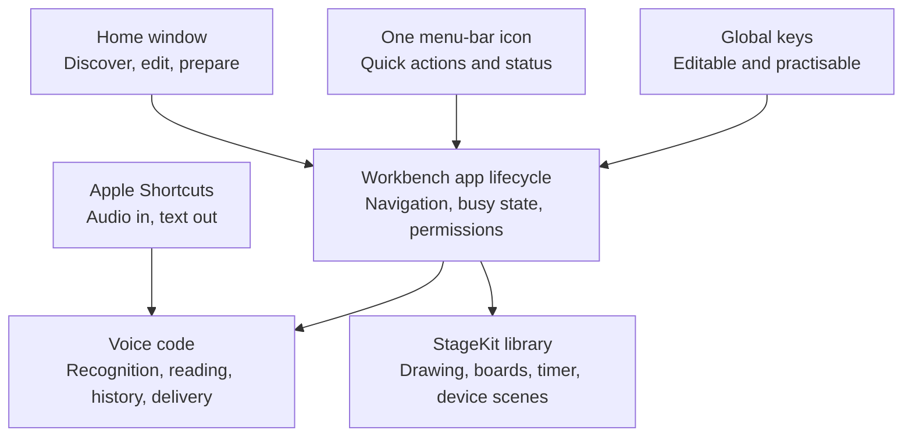

# Workbench product contract

Workbench is one native Mac app for speaking, explaining and presenting. It establishes a useful free baseline: dependable primitives, optional better models and a few thoughtful combinations. A feature earns its place by removing recurring friction beyond the Mac's existing tools.

This contract describes the direction and current consolidation structure. [The acceptance record](unification.md) distinguishes implementation from tested and released behaviour.

## Scope

| Primitive | Workbench's responsibility | Boundary |
| --- | --- | --- |
| Speak → text | Capture/import, recognition, optional cleanup, original wording, history and safe delivery | Other apps own the note, message or document made from the result. |
| Text → speech | Mac reading voices, playback/export and optional online reading | Keep provider setup explicit; do not turn the utility into a general agent platform. |
| Explain a screen | Live drawing, pointer emphasis, boards and a clear return to the demo | A meeting app owns distribution to the audience. |
| Present a device | USB video preview in a saved scene, branding, readable controls and a break timer | QuickTime and iPhone Mirroring remain separate Apple apps. |
| Reuse an item | Searchable prompts, links and file references already supported by the library | No tenant management, browser-profile rotation or team knowledge system. |

Screenshot capture/markup, Services and Share extensions are possible later improvements. Their native equivalents are the starting comparison. Broad demo orchestration, a generic plugin framework and a Windows rewrite are not prerequisites for this version.

## One app, several ways in

The normal window makes the app discoverable. The menu bar and keyboard accelerate familiar work. Recording controls, palettes and presentation windows appear when needed. Closing Home leaves the menu-bar utility running; Quit must stop capture, playback, drawing and presentation. Login launch is an explicit user setting.

Normal application menus, buttons and editable shortcuts remain available together. Spotlight can find the app by name. The existing App Intent accepts audio and returns text; it does not own microphone recording. Additional Spotlight actions, Services, Share extensions and URL automation must be treated as new integrations with their own evidence.

## Interaction rules

- Start microphones and device sessions through an explicit action. Request access when the feature needs it and explain a denied permission in context.
- Keep one owner for an active operation. Model selection cannot change an in-flight request. The host coordinates recording, drawing and keyboard practice so they do not accidentally trigger each other.
- Keyboard is one catalogue across modules. Duplicate assignments and common Mac command conflicts are explained. Failed registration must not silently replace a usable combination.
- Keyboard practice pauses Workbench global actions, consumes practice key presses, counts complete press/release repetitions and restores actions when it ends or the window loses focus. It does not claim a complete inventory of other apps' shortcuts.
- Capture the original app and field before dictation. Paste only when they remain valid; otherwise copy. Never press Return or submit a message. Restore the previous clipboard only after confirmed insertion while Workbench still owns the clipboard change.
- Preserve originals and saved work. Cleanup is optional and reversible. A generated rewrite is not evidence of factual or semantic correctness.
- Ending a scene releases the device and restores presentation changes that Workbench owns. It must not close unrelated apps or silently change the user's system policies.

## Models stay replaceable

Parakeet is the account-free, on-device default. A separately run, loopback-only transcription server is an explicit alternative. The app preserves the same capture, cleanup, history and delivery flow when recognition changes. A saved configuration is not a connectivity or quality check.

Mac voices are the default for reading. Speko is a separate online choice with its own key and usage. No provider failure silently routes data elsewhere. User-managed server software controls whether its local endpoint forwards audio beyond the Mac; Workbench cannot promise its end-to-end privacy.

Prefer a small explicit provider contract over a general agent framework. Add another adapter when a real model/runtime can meet its input, cancellation, readiness and privacy requirements. See [model providers](model-providers.md).

## Appearance and onboarding

Keep the Workbench name and a shared restrained mint/slate palette, system typography, native controls, clear states and System/Light/Dark choices. The primary verbs are **Dictate**, **Read aloud**, **Annotate** and **Present a device**. A label should explain an action; a status should describe what actually happened.

Home introduces useful actions, first-use access requests explain themselves, and keyboard practice teaches muscle memory. Prefer these working experiences over an introductory slideshow. Use synthetic scenes, text and recordings in examples. Brand assets can improve later without changing the action or data architecture.

## Identity, migration and release

The unified identities are `com.ethdawg.workbench` and `com.ethdawg.workbench.preview`; packaged executables are `Workbench` and `WorkbenchPreview`. `LocalVoice` remains the internal Swift executable target/module. `StageKit` is a library in the same process, with no independent status item or application lifecycle.

Preview lives at `~/Applications/Workbench Preview.app` and has its own saved files, preferences and permissions. Supported legacy Voice/StageMark files are copied once into missing unified component directories; original data remains untouched. Do not run repeated merges from old app state. Do not reset privacy permissions or erase user data to simplify a release. Keep the signing identity and installation path consistent.

A build, an installed Preview, a reviewed merge, a notarized archive and a published release are separate claims. Each needs its own evidence. Before promotion, test the actual package: first use, permissions, migration, global keys, recording/cancellation, paste, presentation lifecycle and the hardware-dependent paths affected by the change. App Store submission is a separate workflow.

## Small-project maintenance

Use GitHub issues for agreed work, PRs for review and releases for downloadable versions. A substantial shared change needs an owner before implementation and another person's review before acceptance. [CONTRIBUTING](../CONTRIBUTING.md#proposed-ethanmatt-working-agreement) records the proposed Ethan–Matt practices; it does not assert that repository permissions or approval rules have been configured.

The short implementation map is [design.md](design.md). The earlier suite model of two independently shipped apps is superseded by this consolidation contract.
